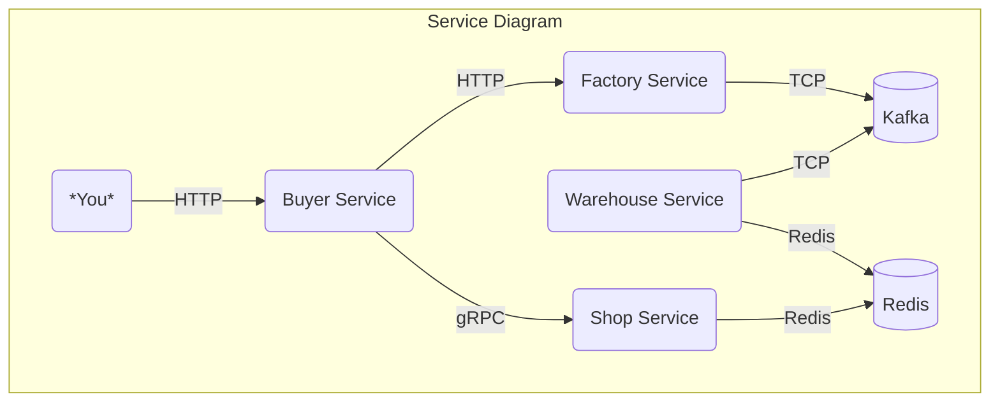
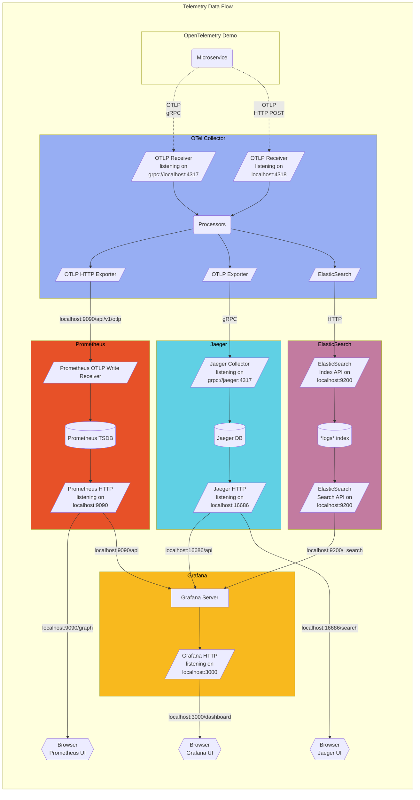

# OpenTelemetry Workshop of Engineering Conference 2024

Repository provides environment for OpenTelemetry workshop held at Vinted Engineering Conference 2024.

## Prerequisites

- Docker
- [Docker Compose](https://docs.docker.com/compose/install/#install-compose) v2.0.0+
- 6 GB of RAM for the application
- [Golang](https://go.dev/doc/install) v1.22.0+

## Get and run workshop

1. Clone the workshop repository:

```shell
git clone https://github.com/niaurys/otel-workshop-2024.git
```

2. Change to the workshop folder:

```shell
cd otel-workshop-2024/
```

3. Start the workshop:

```shell
docker compose up --force-recreate --remove-orphans --detach
```

4. Rebuild everything and start again (after changes):

```shell
docker compose up --detach --build 
```

## Instrumentation packages

To get started with instrumentation flowing dependencies can be installed:

```shell
go get "go.opentelemetry.io/otel" \
  "go.opentelemetry.io/otel/exporters/otlp/otlpmetric/otlpmetrichttp" \
  "go.opentelemetry.io/otel/exporters/stdout/stdouttrace" \
  "go.opentelemetry.io/otel/exporters/otlp/otlptrace/otlptracehttp" \
  "go.opentelemetry.io/otel/sdk/log" \
  "go.opentelemetry.io/otel/log/global" \
  "go.opentelemetry.io/otel/propagation" \
  "go.opentelemetry.io/otel/sdk/metric" \
  "go.opentelemetry.io/otel/sdk/resource" \
  "go.opentelemetry.io/otel/sdk/trace"
```

## Telemetry infrastructure

Once the images are built and containers are started you can access:

- Grafana: <http://localhost:3000>
- Jaeger UI: <http://localhost:16686>
- Prometheus: <http://localhost:9090>
- Kafka UI: <http://localhost:8081>

## Architecture

**OpenTelemetry Workshop** is composed of microservices written in Golang that talk to each other over gRPC or HTTP and uses clients of popular technologies like Kafka and Redis.

Please check `docker-compose.yaml` and `.env` files for exact configurations parameters.

The **Protocol Buffer Definitions** are in the `/pb/` directory.



It is possible to trigger Buyer service endpoint `/order` to place "order" for Factory service, which will be picked up by Warehouse service and randomly sold in Shop. For example:

```bash
curl http://localhost:3001/order \
  --data '{ "name": "watch", "color": "purple", "quantity":130}'
```

## Telemetry services architecture

The collector is configured in
[otelcol-config.yml](./config/otelcollector/otelcol-config.yml),
alternative exporters can be configured if needed.



## Useful links

- [OpenTelemetry documentation](https://opentelemetry.io/docs/)
- [OpenTelemetry Go documentation](https://opentelemetry.io/docs/languages/go/)
- [OpenTelemetry Go API and SDK](https://github.com/open-telemetry/opentelemetry-go)
- [OpenTelemetry Go API and SDK extensions](https://github.com/open-telemetry/opentelemetry-go-contrib)
- [Metric Supplementary Guidelines](https://opentelemetry.io/docs/specs/otel/metrics/supplementary-guidelines/)

Specification:

- [Configuration Environment Variables](https://opentelemetry.io/docs/specs/otel/configuration/sdk-environment-variables/)
- [OpenTelemetry Semantic Conventions](https://opentelemetry.io/docs/specs/semconv/)
- [OpenTelemetry Protocol (OTLP)](https://opentelemetry.io/docs/specs/otlp/)
- [Tracing](https://opentelemetry.io/docs/specs/otel/trace/)
- [Metrics](https://opentelemetry.io/docs/specs/otel/metrics/)
- [Logs](https://opentelemetry.io/docs/specs/otel/logs/)
- [Baggage](https://opentelemetry.io/docs/specs/otel/baggage/)

OpenTelemetry showcase:

- [OpenTelemetry demo](https://opentelemetry.io/docs/demo/)
